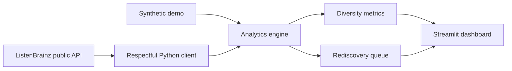

# OpenEar 🎧

**Discover beyond the algorithm.** OpenEar is a privacy-first, open-source dashboard that turns public ListenBrainz history into transparent music-diversity insights and a personal rediscovery queue.

## Why it matters

Recommendation systems often optimise for familiarity and engagement. That can narrow attention around already dominant artists. OpenEar gives listeners an understandable view of concentration, variety and long-tail listening—without judging taste or selling personal data.

## What it does

- imports up to 5,000 public listens from ListenBrainz;
- calculates explainable **Diversity** and **Discovery** scores;
- shows artist concentration and long-tail listening;
- surfaces artists heard only once or twice in a **Rediscovery Queue**;
- provides deterministic synthetic demo data for visitors without an account;
- processes data only in the active session and stores no credentials or history.

## Metric design

| Metric | Explanation |
|---|---|
| Diversity Score | 75% normalised Shannon entropy + 25% resistance to top-artist concentration |
| Discovery Score | 55% artist breadth + 45% long-tail share |
| Long-tail share | Percentage of listens from artists played no more than twice |

Scores describe listening patterns, not the quality of anyone's taste. The formulas are deliberately visible and testable.

## Architecture



## Quick start

```bash
python -m venv .venv
source .venv/bin/activate
pip install -e . pytest streamlit pandas
streamlit run app.py
```

Open `http://localhost:8501` and either enter a public ListenBrainz username or choose the demo.

### Docker

```bash
docker compose up --build
```

### Tests

```bash
pytest -q
```

## Privacy principles

1. No account authentication or access token is requested.
2. No username or listening history is persisted.
3. The default demo uses entirely synthetic data.
4. Recommendations are explainable rediscoveries, not behavioural profiling.
5. Users remain in control of what public history they analyse.

## Responsible API use

OpenEar identifies itself with a descriptive User-Agent, applies timeouts, limits imports and avoids aggressive polling. Future MusicBrainz enrichment will respect its published one-request-per-second limit.

## Roadmap

- opt-in MusicBrainz genre enrichment with caching and rate limiting;
- comparison across time windows without storing raw history;
- accessibility review and multilingual interface;
- exportable, anonymised personal report;
- community-curated discovery links for independent artists.

## Contributing

Issues and pull requests are welcome. Please avoid submitting real listening-history files; use the demo generator in tests and examples.

## Data sources

- [ListenBrainz](https://listenbrainz.org/) for public listening history
- [MusicBrainz](https://musicbrainz.org/) for future open metadata enrichment

This project is independent and is not affiliated with ListenBrainz or MusicBrainz.
